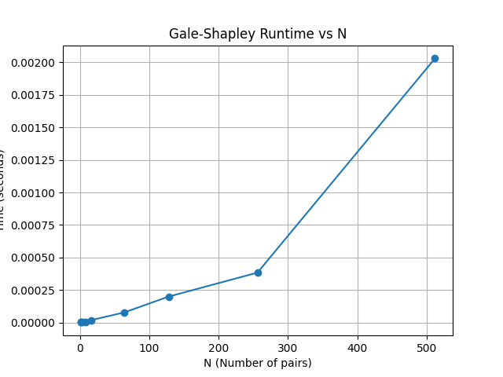

# COP4533_Programming_Assignment1

**Team Members:**
* **Justin Oh** (78478358)
* **Adam Lim** (23149660)

---

## Project Overview
This project implements the **Gale-Shapley Algorithm** (Hospital-Proposing Deferred Acceptance) to solve the Stable Matching problem. It includes:
1.  **Matching Engine (Task A):** Finds a stable matching for $N$ hospitals and $N$ students.
2.  **Verifier (Task B):** Validates that the output is a perfect bijection and contains no blocking pairs.
3.  **Scalability Analysis (Task C):** A benchmark script to measure runtime performance as $N$ increases.

---

## Directory Structure
* `src/main.py`: The core program containing the `StableMatcher` class, input parser, and verifier.
* `src/gen.py`: A utility script to generate random input files for testing.
* `src/benchmark.py`: A script to automate performance testing and plot the time complexity graph.
* `scalability_graph.png`: The output graph from the benchmark script.

---

## Setup & Dependencies
The project is written in **Python 3**.
* No compilation is required.
* **Standard Libraries used:** `sys`, `random`, `collections`, `time`, `os`.
* **External Library (Task C only):** `matplotlib` is required to generate the graph.
    ```bash
    pip install matplotlib
    ```

---

## How to Run

### 1. The Matcher (Task A)
The program reads input from `stdin` (standard input) and prints the resulting stable matching to `stdout` (standard output).

**Command:**
```bash
python3 src/main.py match < data/example.in
```


### 2. The Verifier (Task B)
The verifier checks if a matching is **VALID** (1-to-1 bijection) and **STABLE** (no blocking pairs).
It requires two pieces of information to work:
1. The original input configuration (to know the preferences).
2. The proposed matching (the output generated by the matcher).

You can run this using following methods:

**Command:**
First, save the matcher's output to a text file, then feed both the original input and the output file into the verifier.

```bash
python3 src/main.py match data/example.out < data/example.in

python3 src/main.py verify data/example.in data/example.out
```

## Task C: Scalability Analysis & Graph

### Instructions to Run Benchmark
To reproduce the scalability data and generate the performance graph, run the benchmark script. This script automatically generates random test cases for sizes $N = 1, 2, \dots, 512$, times both the matcher and verifier, and uses `matplotlib` to plot the results.

**Command:**
```bash
python3 src/benchmark.py
```



### Trend Analysis
The performance graph demonstrates a clear **non-linear growth** in running time as the input size ($N$) increases for both the matcher and the verifier.

* **Small Inputs ($N < 128$):** The execution time remains negligible and appears to grow linearly.
* **Large Inputs ($N > 256$):** A distinct upward curve becomes visible. Notably, when the input size doubles from $N=256$ to $N=512$, the runtime increases by a factor significantly larger than 2 (approximately 5x in our tests).

### Conclusion
The observed trend is consistent with the theoretical time complexity of the Gale-Shapley algorithm.

1.  **Theoretical Complexity:** The algorithm has a worst-case time complexity of $O(N^2)$ and an average-case complexity of $O(N \log N)$.
2.  **Experimental Validation:** The "hockey stick" shape of our graph confirms that as $N$ scales, the cost of processing preference lists and managing proposals accelerates. This supports the conclusion that the implementation behaves quadratically (O(N^2)) in practice for the given random datasets.
3.  **Verifier Behavior:** The verifier also exhibits quadratic scaling, since it must check all potential blocking pairs.

## Assumptions

### 1. Input Format
* **Structure:** We assume the input strictly follows the assignment specification:
    * **Line 1:** A single integer $N$ (the number of hospitals/students).
    * **Next $N$ lines:** Hospital preference lists. Each line contains $N$ integers separated by spaces, representing a permutation of $1 \dots N$.
    * **Next $N$ lines:** Student preference lists. Each line contains $N$ integers separated by spaces.
* **Indexing:** The input uses **1-based indexing** (Hospitals and Students are numbered $1$ to $N$). Our internal logic converts this to 0-based for list access but converts it back to 1-based for the final output.

### 2. Output Format
* The matcher outputs exactly $N$ lines.
* Each line contains two integers: `Hospital_ID Student_ID`.
* The output is sorted by Hospital ID (e.g., Hospital 1's match first, then Hospital 2's, etc.).

### 3. Dependencies
* **Python Version:** The code assumes a standard **Python 3** environment.
* **Libraries:** The core Matcher and Verifier rely only on Python's standard library (`sys`, `collections`, `random`).
* **Optional:** The `benchmark.py` script (Task C) requires `matplotlib` to generate the graph. If this library is missing, the benchmark script may fail or must be run in an environment where it is installed.

### 4. Validity
* We validate that $N \ge 1$.
* We validate that each preference list is a permutation of $1 \dots N$ and that the input contains at least $2N^2 + 1$ integers (extra trailing tokens are ignored).

